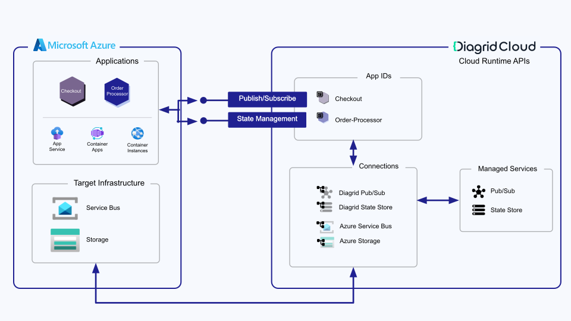
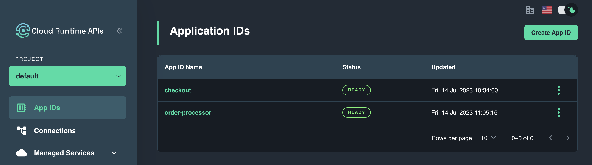
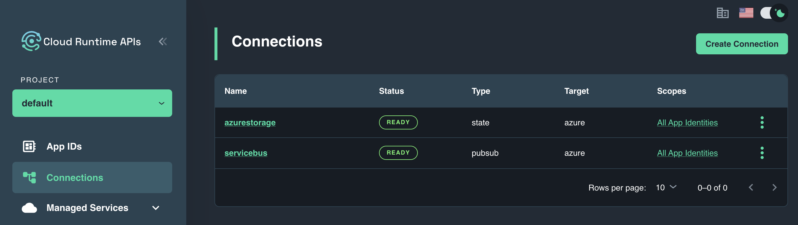
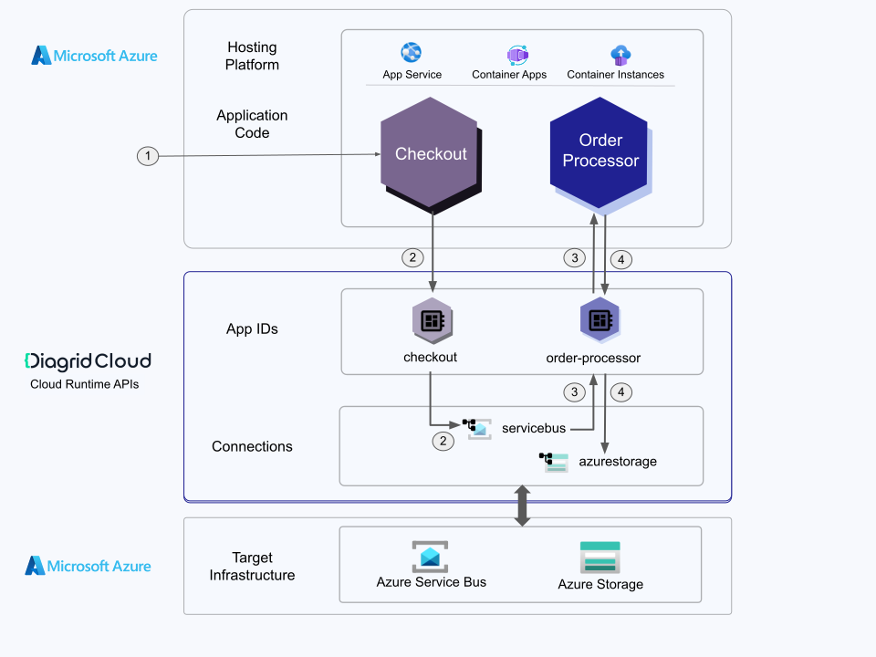
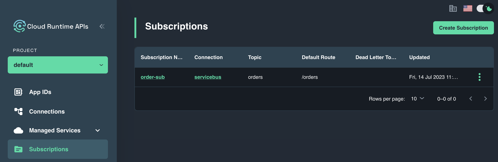

# Cloud Runtime APIs with Azure-Hosted Resources

## Tutorial overview

In this tutorial, you will learn how to interact with Diagrid APIs from an ordering solution running on Azure compute and leveraging Azure infrastructure resources for Pub/Sub communication and state management.

The ordering solution consists of two services:

- A Checkout service (C#) which receives orders via HTTP POST and publishes them to a Pub/Sub broker using the Pub/Sub API
- An Order Processor service (C#) which consumes orders from the Pub/Sub broker and persists them in a key-value store via the State Management API



> Note: The tutorial includes prerequisite steps for deploying cloud infrastructure for completeness, however this is a one-time setup and optional if you want to update an existing cloud-hosted solution to leverage the Diagrid APIs.

The tutorial is broken down into the following sections:

- Deployment of cloud-based infrastructure resources including a Pub/Sub broker and Key-value store
- Creation and configuration of Diagrid APIs for Pub/Sub and State Management
- Deployment of containerized applications to cloud-based hosting platform
- Validation of end-to-end solution

The application deployment section will dive deeper into the inner workings of the applications and how they leverage the Diagrid APIs.

## Tutorial Setup

### Prerequisites

| Requirement       | Instructions                                                                                                                                                                                      |
| ----------------- | ------------------------------------------------------------------------------------------------------------------------------------------------------------------------------------------------- |
| Diagrid Account   | Follow Getting Started section from [here](../../docs/4-support.md). |
| Diagrid CLI       | Follow Getting Started section from [here](../../docs/4-support.md). |
| GitHub Account    | Get one for [free](https://github.com/join). |
| git               | [Install git](https://git-scm.com/downloads) |
| Azure account     | If you don't have one, [create an account for free](https://azure.microsoft.com/free/?WT.mc_id=A261C142F). You need the _Contributor_ or _Owner_ permission on the Azure subscription to proceed. |
| Azure CLI         | Install the [Azure CLI](/cli/azure/install-azure-cli). |
| yq utility (Opt.) | Install command-line YAML processor [yq](https://github.com/mikefarah/yq#install) |
| jq utility (Opt.) | Install command-line JSON processor [jq](https://jqlang.github.io/jq/download/) |

### Azure Setup

Sign in to Azure.

```bash
az login
```

Ensure you're running the latest version of the Azure CLI via the upgrade command.

```bash
az upgrade
```

Set environment variables which will be used in the deployment of Azure resources:

```bash
export RESOURCE_GROUP="cra-rg"
export LOCATION="eastus"
export SERVICEBUS_NAMESPACE="your-unique-namespace"
export STORAGEACCOUNT_NAME="yourstorageaccount"
```

### Cloud Runtime API Setup

Sign in to Diagrid Cloud by confirming the browser prompt and setting an organization.

```bash
diagrid login
diagrid orgs list
    
# Confirm your login credentials
diagrid whoami
```

Set environment variables which will be used in the creation of Cloud Runtime API resources:

```bash
export CRA_PROJECT="default"
export PUBSUB_CONNECTION="servicebus"
export STATE_CONNECTION="azurestorage"
export PUBSUB_TOPIC="orders"
```

## Deploy Azure Infrastructure resources

Create an Azure Resource group to host the collection of Azure resources used by the ordering solution.

```bash
az group create --name $RESOURCE_GROUP --location $LOCATION
```

### Deploy Pub/Sub Broker

Create an Azure Service Bus Namespace

```bash
az servicebus namespace create --resource-group $RESOURCE_GROUP --name $SERVICEBUS_NAMESPACE --location $LOCATION  --sku Standard
```

Create a topic in the Service Bus Namespace which will provide a one-to-many form of communication for the order solution via the publish and subscribe pattern.

```bash
az servicebus topic create --name orders --namespace-name $SERVICEBUS_NAMESPACE --resource-group $RESOURCE_GROUP
```

Retrieve the Service Bus connection string and store in an environment variable. This credential will be used by the Diagrid Pub/Sub API to connect to the topic created above.

```bash
export SB_CONNECTION_STRING=`az servicebus namespace authorization-rule keys list --resource-group $RESOURCE_GROUP --namespace-name $SERVICEBUS_NAMESPACE --name RootManageSharedAccessKey --query primaryConnectionString -o tsv`
```

> Recommended: Confirm successful retrieval by running `echo $SB_CONNECTION_STRING`

### Deploy Key-Value Store

Create an Azure Storage Account which will be used to persist order data from the order processor.

```bash
az storage account create --name $STORAGEACCOUNT_NAME --resource-group $RESOURCE_GROUP --location $LOCATION --sku Standard_RAGRS --kind StorageV2
```

Retrieve the Storage Account key and store it in an environment variable. This credential will be used by the Diagrid State API to connect to the storage account created above.

```bash
export STORAGE_KEY=`az storage account keys list -g $RESOURCE_GROUP -n $STORAGEACCOUNT_NAME | jq -r '.[0].value'`
```

> Recommended: Confirm successful retrieval by running `echo $STORAGE_KEY`

## Deploy CRA Resources

### Create Project

If you do not have a default project available in your organization, create a CRA project which will be used to deploy CRA resources related to the tutorial. Otherwise, skip to the following section.

```bash
diagrid project create $CRA_PROJECT
```

Set the default project in the CLI to use this project for future Diagrid CLI operations.

```bash
diagrid project use $CRA_PROJECT
```

### Application Identities

Deploy an Application Identity (App ID) for the Checkout service. An App ID is the CRA representation of your externally hosted microservice, and can be used to establish what an application can and can't do within CRA.

```bash
diagrid appid create checkout
```

Retrieve the API token for the checkout service. The API token will be used to establish connectivity from the checkout application code to the Diagrid-hosted App ID.

```bash
CHECKOUT_API_TOKEN=`diagrid appid get checkout -o json | jq -r .status.apiToken`
```

Repeat the above steps for the order processor service. Each microservice should have a unique, dedicated App ID in CRA.

```bash
diagrid appid create order-processor
```

```bash
ORDERPROCESSOR_API_TOKEN=`diagrid appid get order-processor -o json | jq -r .status.apiToken`
```

Login to the CRA portal to view the two App Ids that you have just created. Navigate to [https://cra.diagrid.io/app-ids](https://cra.diagrid.io/app-ids) in the browser and sign in with your email address that was invited to Diagrid Cloud.



### Diagrid Connections

The ordering system requires two Diagrid connections:

1. `servicebus`: The connection to establish connectivity from Diagrid Cloud to your externally deployed Service Bus instance. Connection access will be scoped to both the `order-processor` and `checkout` App IDs, as both will be interacting with the underlying broker.

1. `azurestorage`: The connection to establish connectivity from Diagrid Cloud to your externally deployed Storage Account. Connection access will be scoped specifically to the `order-processor` App ID for storing orders in Azure Storage.

---

Navigate to the connections directory to ensure the subsequent commands are executed on the appropriate files

```bash
cd samples/csharp-azure/connections
```

Update the `pubsub.yaml` manifest in the `connections` directory with the value stored in the `SB_CONNECTION_STRING` environment variable.

```bash
yq e ".spec.metadata[0].value = \"$SB_CONNECTION_STRING\"" -i pubsub.yaml
```

Update the `state.yaml` manifest in the `connections` directory with the values stored in the `STORAGE_KEY` and `STORAGEACCOUNT_NAME` environment variables.

```bash
yq e ".spec.metadata[0].value = \"$STORAGE_KEY\"" -i state.yaml
```

```bash
yq e ".spec.metadata[1].value = \"$STORAGEACCOUNT_NAME\"" -i state.yaml
```

Deploy both connections to CRA using the `diagrid connection apply` command.

```bash
diagrid connection apply -f pubsub.yaml
diagrid connection apply -f state.yaml
```

> Recommendation: To view all connections in the project run `diagrid connection list`

Check the CRA connection to ensure its status is `Ready` by navigating to the CRA UI [Connections page](https://cra.diagrid.io/connections) and viewing the list of connections.



### Retrieve Project URL

Retrieve the gRPC endpoint for the project. This endpoint will be used as the primary point of ingress for connecting to the hosted Diagrid APIs.

```bash
GRPC_URL=`diagrid project get -o json | jq -r '.status.endpoints.grpc.url'`
```

## Deploy Applications to Azure

As mentioned, the ordering soution is composed of two C# applications: a checkout service and an order processor service. Let's dive deeper into the two services and how they leverage the Diagrid APIs. We will deploy the order processor service first in order to retrieve it's endpoint for use in the Diagrid Pub/Sub Subscription.



1. A user initiates an order via HTTP POST on the checkout service.
1. The checkout application utilizes the `Diagrid Pub/Sub API` to publish a message using the `checkout` App ID and a Pub/Sub connection called `servicebus` which facilitates the message delivery to the backing Azure Service Bus broker.
   > Note: These values are passed into the application via environment variables.
   > 
1. The order processor application subscribes to the messages delivered to the `orders` topic by the checkout service through a `Diagrid Pub/Sub Subscription`. The order messages are delivered to the checkout service at `/orders`.
1. The order processor uses the `Diagrid State Management API` to store the order as a key-value pair using the `order-processor` App ID and a State connection called `azurestorage` which facilitates the data persistance to the backing Azure Storage Account.
   
   > Note: These values are passed into the application via environment variables.

Container images for both applications are provided for you. For the application deployment, you can choose to target either Azure Container Apps, Azure App Service or Azure Container Instances. Instructions for deployment to each can be found in the proceeding sections.

---

### Azure Container Apps

Ensure you have the necessary extensions installed and providers registered for working with Azure Container Apps.

```bash
az extension add --name containerapp --upgrade
az provider register --namespace Microsoft.App
az provider register --namespace Microsoft.OperationalInsights
```

Set the following environment variables for deploying to Azure Container Apps.

```bash
export CONTAINERAPPS_ENVIRONMENT=aca-env-cra
```

Deploy an Azure Container Apps Environment to host the checkout and order processing microservices.

```bash
az containerapp env create --name $CONTAINERAPPS_ENVIRONMENT --resource-group $RESOURCE_GROUP --location "$LOCATION"
```

Deploy a container app for the checkout service, passing in the CRA environment variables used to establish connectivity from the application to Diagrid Cloud.

```bash
az containerapp create \
--name checkout \
--resource-group $RESOURCE_GROUP \
--environment $CONTAINERAPPS_ENVIRONMENT \
--ingress external --target-port 5000 \
--image 'us-central1-docker.pkg.dev/prj-common-d-shared-89549/reg-d-common-docker-public/cra-pb-csharp/checkout:2.0' \
--min-replicas 1 \
--env-vars PUBSUB_NAME="$PUBSUB_CONNECTION" TOPIC="orders" DAPR_API_TOKEN="$CHECKOUT_API_TOKEN" DAPR_RUNTIME_HOST="$GRPC_URL" DAPR_GRPC_PORT="443"
```

Retrieve the application FQDN for the checkout service.

```bash
export CHECKOUT_ENDPOINT=https://`az containerapp show --name checkout --resource-group $RESOURCE_GROUP | jq -r .properties.configuration.ingress.fqdn`
```

Deploy a container app for the order processor, passing in the CRA environment variables used to establish connectivity from the application to Diagrid Cloud.

```bash
az containerapp create --name order-processor \
--resource-group $RESOURCE_GROUP \
--environment $CONTAINERAPPS_ENVIRONMENT \
--image 'us-central1-docker.pkg.dev/prj-common-d-shared-89549/reg-d-common-docker-public/cra-pb-csharp/order-processor:2.0' \
--ingress external --target-port 5000 \
--min-replica 1 \
--env-vars STATESTORE_NAME="$STATE_CONNECTION" DAPR_API_TOKEN="$ORDERPROCESSOR_API_TOKEN" DAPR_RUNTIME_HOST="$GRPC_URL" DAPR_GRPC_PORT="443"
```

Retrieve the application FQDN for the order processor service.

```bash
export ORDERPROCESSOR_ENDPOINT=https://`az containerapp show --name order-processor --resource-group $RESOURCE_GROUP | jq -r .properties.configuration.ingress.fqdn`
```
Continue to the [Configure CRA Pub/Sub subscription](#configure-cra-pub/sub-subscription) section.

### Azure Container Instances

Set the following environment variables for deploying to Azure Container Instances.

```bash
export DNS_SUFFIX="your-unique-suffix"
```

Deploy a container instance for the checkout service, passing in the CRA environment variables used to establish connectivity from the application to Diagrid Cloud.

```bash
az container create --name checkout \
--resource-group $RESOURCE_GROUP \
--ip-address public --dns-name-label checkout --ports 5000 \
--image 'us-central1-docker.pkg.dev/prj-common-d-shared-89549/reg-d-common-docker-public/cra-pb-csharp/checkout:2.0' \
--environment-variables PUBSUB_NAME="$PUBSUB_CONNECTION" TOPIC="orders" DAPR_API_TOKEN="$CHECKOUT_API_TOKEN" DAPR_RUNTIME_HOST="$GRPC_URL" DAPR_GRPC_PORT="443"
```

Retrieve the application FQDN for the checkout service.

```bash
export CHECKOUT_ENDPOINT=http://`az container show --name checkout --resource-group $RESOURCE_GROUP | jq -r .ipAddress.fqdn`:5000
```

Deploy a container instance for the order processor, passing in the CRA environment variables used to establish connectivity from the application to Diagrid Cloud.

```bash
az container create --name order-processor \
--resource-group $RESOURCE_GROUP \
--image 'us-central1-docker.pkg.dev/prj-common-d-shared-89549/reg-d-common-docker-public/cra-pb-csharp/order-processor:2.0' \
--ip-address public --dns-name-label order-processor-$DNS_SUFFIX --ports 5000 \
--environment-variables STATESTORE_NAME="$STATE_CONNECTION" DAPR_API_TOKEN="$ORDERPROCESSOR_API_TOKEN" DAPR_RUNTIME_HOST="$GRPC_URL" DAPR_GRPC_PORT="443"
```

Retrieve the application FQDN for the order processor service.

```bash
export ORDERPROCESSOR_ENDPOINT=http://`az container show --name order-processor --resource-group $RESOURCE_GROUP | jq -r .ipAddress.fqdn`
```

Continue to the [Configure CRA Pub/Sub subscription](#configure-cra-pub/sub-subscription) section.

### App Service

Set the following environment variables for deploying to Azure App Service.

```bash
export APP_SUFFIX="your-unique-suffix"
```

Create an App Service Plan to host the checkout and order processing microservices.

```bash
az appservice plan create --name ordering-solution --resource-group $RESOURCE_GROUP --sku free --is-linux
```

Deploy a web app for the checkout service.

```bash
az webapp create --name checkout-$APP_SUFFIX --resource-group $RESOURCE_GROUP --plan ordering-solution \
-i 'us-central1-docker.pkg.dev/prj-common-d-shared-89549/reg-d-common-docker-public/cra-pb-csharp/checkout:2.0'
```

Set the appropriate app settings for the web app to ensure the application can access necessary environment variables for connecting to the Diagrid APIs.

```bash
az webapp config appsettings set -g $RESOURCE_GROUP -n checkout-$APP_SUFFIX \
--settings PUBSUB_NAME="$PUBSUB_CONNECTION" TOPIC="orders" DAPR_API_TOKEN="$CHECKOUT_API_TOKEN" DAPR_RUNTIME_HOST="$GRPC_URL" DAPR_GRPC_PORT="443" WEBSITES_PORT=5000
```

Restart the web app to ensure the newly added app settings are available to the application

```bash
az webapp restart --resource-group $RESOURCE_GROUP --name checkout-$APP_SUFFIX
```

Retrieve the default hostname for the checkout service.

```bash
export CHECKOUT_ENDPOINT=http://`az webapp show --name checkout-$APP_SUFFIX --resource-group $RESOURCE_GROUP | jq -r .defaultHostName`
```

Deploy a web app for the order processor service.

```bash
az webapp create --name orderprocessor-$APP_SUFFIX --resource-group $RESOURCE_GROUP --plan ordering-solution \
-i 'us-central1-docker.pkg.dev/prj-common-d-shared-89549/reg-d-common-docker-public/cra-pb-csharp/order-processor:2.0'
```

Set the appropriate app settings for the web app to ensure the application can access necessary environment variables for connecting to the Diagrid APIs.

```bash
az webapp config appsettings set -g $RESOURCE_GROUP -n orderprocessor-$APP_SUFFIX \
--settings STATESTORE_NAME="$STATE_CONNECTION" DAPR_API_TOKEN="$ORDERPROCESSOR_API_TOKEN" DAPR_RUNTIME_HOST="$GRPC_URL" DAPR_GRPC_PORT="443" WEBSITES_PORT=5000
```

Restart the web app to ensure the newly added app settings are availble to the application

```bash
az webapp restart --resource-group $RESOURCE_GROUP --name orderprocessor-$APP_SUFFIX
```

Retrieve the default hostname for the order processor service.

```bash
export ORDERPROCESSOR_ENDPOINT=http://`az webapp show --name orderprocessor-$APP_SUFFIX --resource-group $RESOURCE_GROUP | jq -r .defaultHostName`
```

Continue to the [Configure CRA Pub/Sub subscription](#configure-cra-pub/sub-subscription) section.

## Configure CRA Pub/Sub subscription

In order to receive messages using the Diagrid Pub/Sub API, the order processor App ID needs to be updated with the following:

1. The application endpoint of the order processor application in Azure for message delivery.
1. A Pub/Sub subscription notifying the CRA platform which messages should be delivered to the order processor and on which route.

### Update the Order Processor Application ID with the App Endpoint

```bash
diagrid appid update order-processor --app-endpoint $ORDERPROCESSOR_ENDPOINT
```

### Create CRA Subscription

The below subscription targets the Pub/Sub connection created above, telling CRA to deliver messages that arrive on the specified topic to the application represented in CRA by the `order-processor` App ID on the `/orders` route.

```bash
diagrid subscription create order-sub --connection $PUBSUB_CONNECTION --topic $PUBSUB_TOPIC --route /orders --scopes order-processor
```

You can inspect the subscription by navigating to the CRA UI [Subscriptions page](https://cra.diagrid.io/subscriptions). Clicking on the subscription name allows you to view details.



## Testing the solution

You've now successfully deployed the application code and all of the necessary CRA resources to enable pubsub communication and state management. You can use the CRA console to build a request for testing purposes or use the curl requests below to test successful use of the Diagrid APIs.

Retrieve the http endpoint for the project. This endpoint will be used to test the deployed solution.

```bash
export HTTP_URL=`diagrid project get $CRA_PROJECT -o json | jq -r '.status.endpoints.http.url'`
```

### Invoke the Checkout application

```bash
curl -i -X POST $CHECKOUT_ENDPOINT/orders -H "Content-Type: application/json" -d '{"orderId":"1000"}'
```

### Invoke the Pub/Sub API directly

```bash
 curl -i -X POST $HTTP_URL/v1.0/publish/$PUBSUB_CONNECTION/orders \
      -H "Content-Type: application/json" \
      -H "dapr-api-token: $CHECKOUT_API_TOKEN" \
      -d '{"orderId":"1"}'
```

The response should be HTTP 204 (No Content).

### Application Logs

Depending on the hosting platform you targeted, use the following commands to perform additional validation using application logs.

- Azure Container Apps

  ```bash
  az containerapp logs show --name checkout --resource-group $RESOURCE_GROUP --type console --follow
  az containerapp logs show --name order-processor --resource-group $RESOURCE_GROUP --type console --follow
  ```

- Azure Container Instances

  ```bash
  az container logs --resource-group $RESOURCE_GROUP --name checkout
  az container logs --resource-group $RESOURCE_GROUP --name order-processor
  ```

- App Service

  ```bash
  az webapp log tail --name checkout-$APP_SUFFIX --resource-group $RESOURCE_GROUP --provider http
  az webapp log tail --name orderprocessor-$APP_SUFFIX --resource-group $RESOURCE_GROUP --provider http
  ```

## Clean up resources

If you're not going to continue to use this application, run the following command to delete the resource group along with all the resources created in this quickstart.

```bash
az group delete --name $RESOURCE_GROUP
diagrid project delete $CRA_PROJECT
```

Type `Y` and enter.
