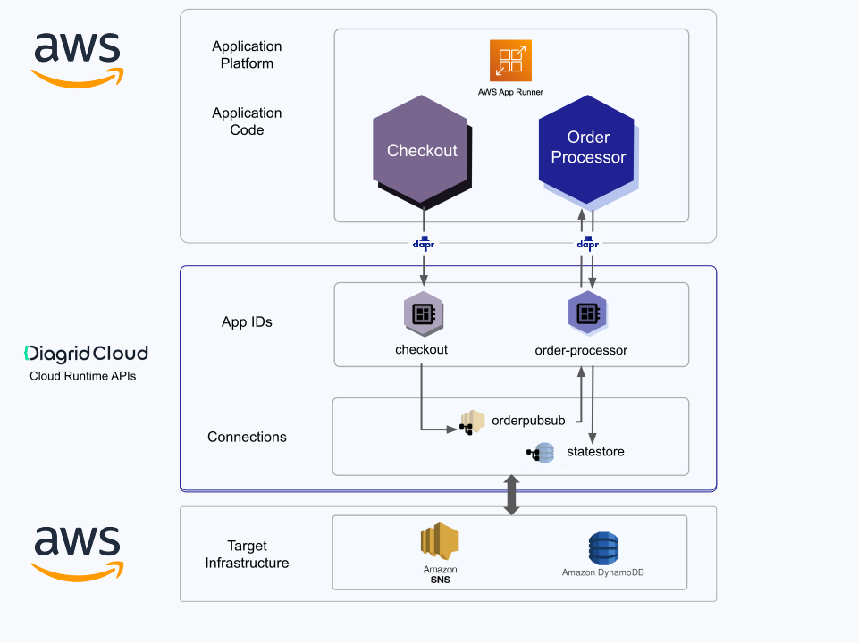
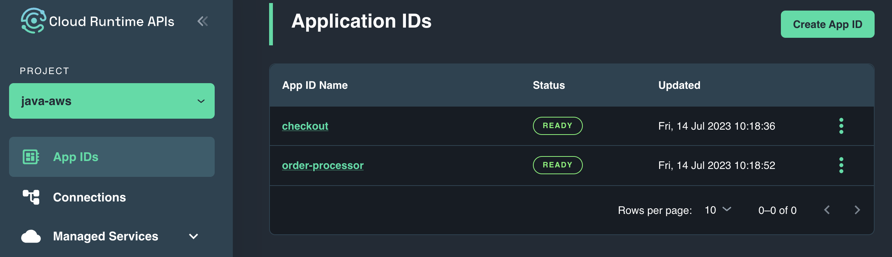
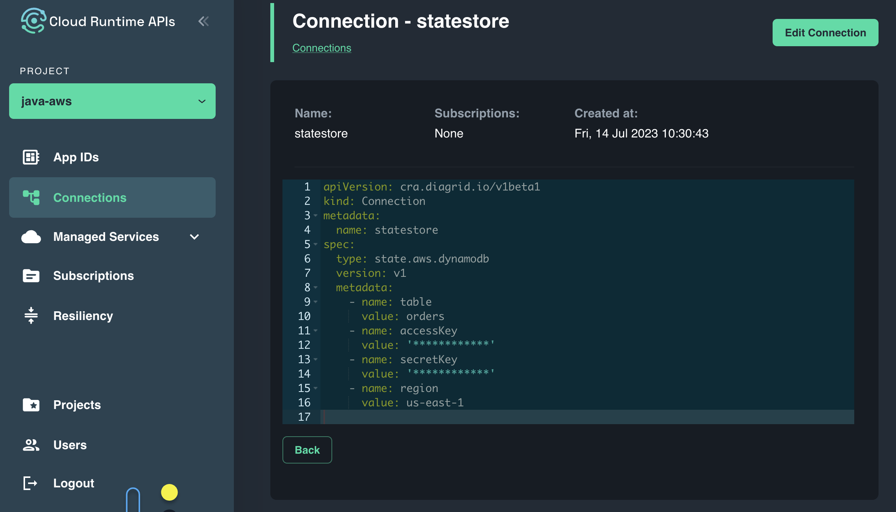
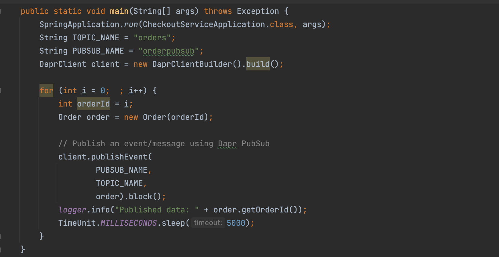
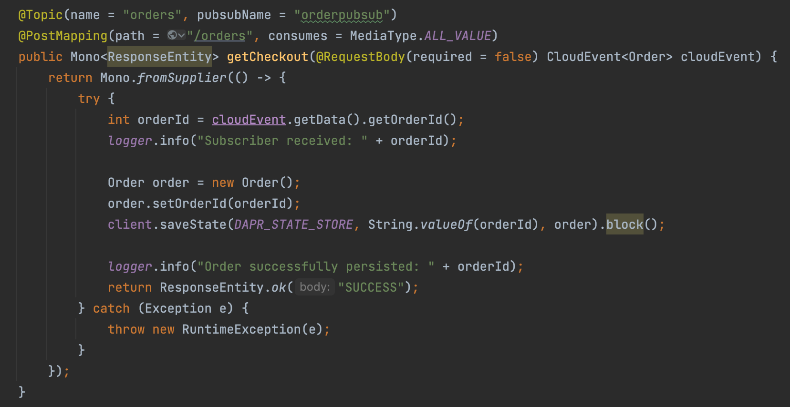
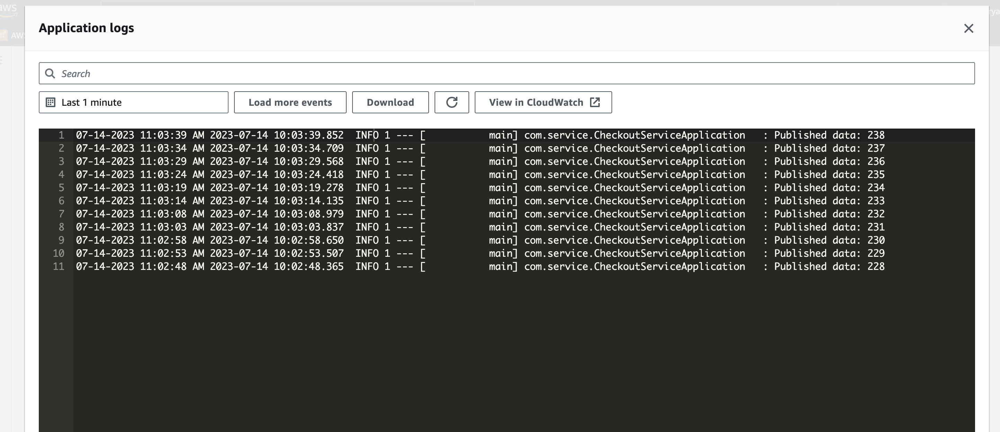
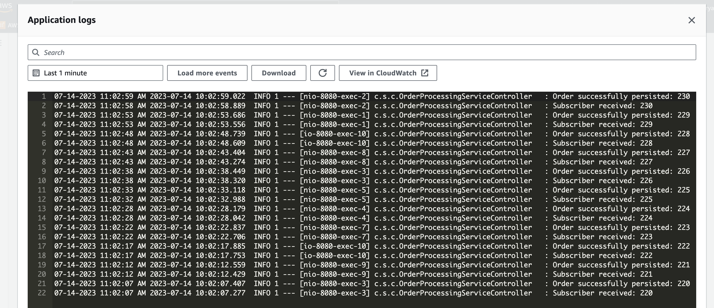

# Cloud Runtime APIs with AWS-Hosted Resources

## Tutorial overview

In this tutorial, you will learn how to interact with Diagrid APIs from a sample ordering application running on AWS App Runner compute and leveraging AWS infrastructure resources for Pub/Sub communication and state management.

The ordering application consists of two services:

- A Checkout service (Java & Spring Boot) which generates an order every 5 seconds and publishes them to an AWS broker using the Pub/Sub API
- An Order-processor service (Java & Spring Boot) which consumes orders from the message broker and persists them in a AWS key-value store via the State Management API



> Note: The tutorial includes prerequisite steps for deploying cloud infrastructure for completeness, however this is a one-time setup and optional if you want to update an existing cloud-hosted solution to leverage the Diagrid APIs.

The tutorial is broken down into the following sections:

- Deployment of cloud-based infrastructure resources including a Pub/Sub broker and Key-value store
- Creation and configuration of Diagrid APIs for Pub/Sub and State Management
- Deployment of containerized applications to cloud-based hosting platform
- Validation of end-to-end solution

The application deployment section will dive deeper into the inner workings of the applications and how they leverage the Diagrid APIs.

## Tutorial Setup

### Prerequisites

| Requirement      | Instructions                                                                                  |
|------------------|-----------------------------------------------------------------------------------------------|
| Diagrid Account  | Follow Getting Started section from [here](../../docs/4-support.md).                          |
| Diagrid CLI      | Follow Getting Started section from [here](../../docs/4-support.md).                     |
| GitHub Account    | Get one for [free](https://github.com/join).                                                  |
| AWS account      | If you don't have one, [create an account](https://aws.amazon.com/resources/create-account/). |
| AWS CLI          | Install the [AWS CLI](https://aws.amazon.com/cli/).                                           |
| jq utility (Opt.) | Install command-line JSON processor [jq](https://jqlang.github.io/jq/download/)               |

## AWS Setup

Retrive your AWS access key and secret. Set environment variables and configure the AWS CLI.

```bash
export AWS_ACCESS_KEY_ID=XXX
export AWS_SECRET_ACCESS_KEY=YYY
export AWS_DEFAULT_REGION=us-east-1

aws configure
```

### Deploy Pub/Sub Broker

The SNS topic and SQS subscription can be created in advance and passed to the application or creatd on the fly. In this case, they are created on the fly.

### Deploy Key-Value Store

Navigate to the `cra-private-beta/tutorials/java-aws` directory to ensure the subsequent commands are executed on the appropriate files.

```bash
cd cra-private-beta/tutorials/java-aws
```

Create an AWS DynamoDB table which will be used to persist order data from the order-processor.

```bash
aws dynamodb create-table --cli-input-json file://aws/ddb-orders-table.json
```

<details>
   <summary>Expected Output</summary>

```bash
   {
    "TableDescription": {
        "AttributeDefinitions": [
            {
                "AttributeName": "key",
                "AttributeType": "S"
            }
        ],
        "TableName": "orders",
        "KeySchema": [
            {
                "AttributeName": "key",
                "KeyType": "HASH"
            }
        ],
        "TableStatus": "CREATING",
        "CreationDateTime": "2023-07-04T09:13:32.481000+02:00",
        "ProvisionedThroughput": {
            "NumberOfDecreasesToday": 0,
            "ReadCapacityUnits": 5,
            "WriteCapacityUnits": 5
        },
        "TableSizeBytes": 0,
        "ItemCount": 0,
        "TableArn": "arn:aws:dynamodb:us-east-1:214575257891:table/orders",
        "TableId": "fd33a103-cc4c-47d2-99ed-d883df5134fa",
        "DeletionProtectionEnabled": false
    }
   }
```

</details>

## Cloud Runtime API Setup

Sign in to Diagrid Cloud by confirming the browser prompt and setting an organization.

```bash
diagrid login
diagrid orgs list

diagrid whoami
```

<details>
   <summary>Expected Outcome</summary>

```bash
   logging in to 'https://api.diagrid.io'...
   Using device code: XXXX-XXX
   Press the ENTER key to open the browser to login or press ctrl-c to abort.
```

   After confirming in the browser you should see in the terminal

```bash
   using organization Demo (3ea85a6c-7fb8-42f1-9ced-df18ed7ce544)
   successfully authenticated.
```

</details>

## Deploy CRA Resources

### Create Project

If you do not have a default project available in your organization, create a CRA project which will be used to deploy CRA resources related to the tutorial. Otherwise, skip to the following section.

```bash
diagrid project create default
```

Set the default project in the CLI to your newly created project.

```bash
diagrid project use default
```

### Create Application Identities

Deploy an Application Identity (App ID) for the Checkout service. An App ID is the CRA representation of your externally hosted microservice, and can be used to establish what an application can and can't do within CRA.

```bash
diagrid appid create checkout
```

<details>
   <summary>Expected Outcome</summary>

```bash
   ✓  Your request has been successfully submitted!
   ○  Check the status of your resource by running the following command:
   ✎  diagrid appid get checkout --project default
```

</details>

Retrieve the API token for the checkout service. The API token will be used to establish connectivity from the checkout application code to the Diagrid-hosted App ID.

```bash
export CHECKOUT_API_TOKEN=$(diagrid appid get checkout -o json  | jq -r '.status.apiToken')
```

Repeat the above steps for the order-processor service. Each microservice should have a unique, dedicated App ID in CRA.

```bash
diagrid appid create order-processor
```

<details>
   <summary>Expected Output</summary>

```bash
   ✓  Your request has been successfully submitted!
   ○  Check the status of your resource by running the following command:
   ✎  diagrid appid get order-processor --project default
```

</details>

Retrieve the API token for the order processor service. The API token will be used to establish connectivity from the order processor application code to the Diagrid-hosted App ID.

```bash
export ORDER_PROCESSOR_API_TOKEN=$(diagrid appid get order-processor -o json  | jq -r '.status.apiToken')
```

#### Check CRA Portal

Login to the CRA portal to view the two App Ids that you have just created. Navigate to [https://cra.diagrid.io/app-ids](https://cra.diagrid.io/app-ids) in the browser and sign in with the email address that was invited to Diagrid Cloud.



### Create Diagrid Connections

The ordering system requires two Diagrid connections:

1. A connection to AWS SNS/SQS
2. A connection to AWS DynamoDB

The Diagrid connection `orderpubsub` seen below will establish connectivity from Diagrid Cloud to AWS SNS/SQS. This connection will ensure all scoped App IDs can use the broker for Pub/Sub communication.

Update the files below with the `AWS_ACCESS_KEY_ID` and `AWS_SECRET_ACCESS_KEY` to use SNS, SQS. You can use the commands below to update the files.

```bash
sed -i "" "s:{AWS_ACCESS_KEY_ID}:$AWS_ACCESS_KEY_ID:g" connections/pubsub.yaml
sed -i "" "s:{AWS_SECRET_ACCESS_KEY}:$AWS_SECRET_ACCESS_KEY:g" connections/pubsub.yaml
```

Deploy the connection to CRA using the `diagrid connection apply` command.

```bash
diagrid connection apply -f connections/pubsub.yaml
```

<details>
    <summary>Expected Output</summary>

```bash
   ✓  Your request has been successfully submitted!
   ○  Check the status of your resource by running the following command:
   ✎  diagrid connection get orderpubsub --project default
```

</details>

The Diagrid connection `statestore` seen below will establish connectivity from Diagrid Cloud to AWS DynamoDB. This connection will be scoped specifically to allow access from the `order-processor` App ID for storing orders.

Update the files below with the `AWS_ACCESS_KEY_ID` and `AWS_SECRET_ACCESS_KEY` to use AWS DynamoDB. You can use the commands below to update the files.

```bash
sed -i "" "s:{AWS_ACCESS_KEY_ID}:$AWS_ACCESS_KEY_ID:g" connections/state.yaml
sed -i "" "s:{AWS_SECRET_ACCESS_KEY}:$AWS_SECRET_ACCESS_KEY:g" connections/state.yaml
```

Deploy the connection to CRA using the `diagrid connection apply` command.

```bash
diagrid connection apply -f connections/state.yaml
```

<details>
    <summary>Expected Output</summary>

```bash
   ✓  Your request has been successfully submitted!
   ○  Check the status of your resource by running the following command:
   ✎  diagrid connection get statestore --project default
```

</details>

> Recommendation: To ensure successful connection deployment run `diagrid connection list`

Check the CRA connection to ensure its status is `Ready` by navigating to the CRA UI [Connections page](https://cra.diagrid.io/connections) and viewing the list of connections. Clicking in on a connection allows you to view its details.



## Deploy AWS Resources

### Deploy Applications into AppRunner

As mentioned, the ordering application is composed of two services: a checkout service and an order processor service. Let's dive deeper into the two services and how they leverage the Diagrid APIs. 

- The checkout service uses the `Diagrid Pub/Sub API` to publish a message every 5 seconds using the `checkout` App ID and a Pub/Sub connection called `orderpubsub`, which facilitates the message delivery to the backing AWS SNS/SQS pair.
   > Note: These values are passed into the application via environment variables.
  > 

- The order processor application subscribes to the messages delivered to the `orders` topic by the checkout service through a `Diagrid Pub/Sub Subscription`. The order messages are delivered to the checkout service at `/orders` endpoint. The order processor uses the `Diagrid State Management API` to store the order as a key-value pair using the `order-processor` App ID and a State connection called `statestore` which facilitates the data persistence to the backing AWS DynamoDB table.
    > Note: These values are passed into the application via environment variables.
  > 

The applications have already been containerized and are provided for you. Use the following instructions to configure and deploy the applications into AWS AppRunner.

### Retrieve Project URLs

Retrieve the HTTP and gRPC endpoints for the project. This endpoint will be the FQDN used to connect to various APIs hosted within the project.

```bash
export DAPR_HTTP_ENDPOINT=$(diagrid project get -o json | jq -r '.status.endpoints.http.url')
export DAPR_GRPC_ENDPOINT=$(diagrid project get -o json | jq -r '.status.endpoints.grpc.url')
```

### Prepare environment variables for AppRunner

Replace the values of `{$DAPR_GRPC_ENDPOINT}`, `{DAPR_HTTP_ENDPOINT}`, and `{DAPR_API_TOKEN}` 
with the respective values prepared so far for aws/checkout.json and aws/order-processor.json files.

```bash
sed -i "" "s|{DAPR_GRPC_ENDPOINT}|$DAPR_GRPC_ENDPOINT|g" aws/checkout.json
sed -i "" "s|{DAPR_HTTP_ENDPOINT}|$DAPR_HTTP_ENDPOINT|g" aws/checkout.json
sed -i "" "s|{DAPR_API_TOKEN}|$CHECKOUT_API_TOKEN|g" aws/checkout.json

sed -i "" "s|{DAPR_GRPC_ENDPOINT}|$DAPR_GRPC_ENDPOINT|g" aws/order-processor.json
sed -i "" "s|{DAPR_HTTP_ENDPOINT}|$DAPR_HTTP_ENDPOINT|g" aws/order-processor.json
sed -i "" "s|{DAPR_API_TOKEN}|$ORDER_PROCESSOR_API_TOKEN|g" aws/order-processor.json
```

### Deploy applications into AWS AppRunner

Deploy both containerized applications as AppRunner instances. The deployment files have CRA environment variables used to establish connectivity from the application to Diagrid Cloud.

```bash
aws apprunner create-service --cli-input-json file://aws/checkout.json
```

<details>
   <summary>Expected Output</summary>

```bash
   {
    "Service": {
        "ServiceName": "checkout",
        "ServiceId": "e7a088e51b4f4e2f85f6153bbf5781b2",
        "ServiceArn": "arn:aws:apprunner:us-east-1:214575257891:service/checkout/e7a088e51b4f4e2f85f6153bbf5781b2",
        "ServiceUrl": "khayxppysq.us-east-1.awsapprunner.com",
        "CreatedAt": "2023-07-04T09:41:30.963000+02:00",
        "UpdatedAt": "2023-07-04T09:41:30.963000+02:00",
        "Status": "OPERATION_IN_PROGRESS",
        "SourceConfiguration": {
            "ImageRepository": {
                "ImageIdentifier": "public.ecr.aws/o3d2i4j6/dapr/checkout:latest",
                "ImageConfiguration": {
                    "RuntimeEnvironmentVariables": {
                        "DAPR_HTTP_ENDPOINT": "",
                        "DAPR_API_TOKEN": "",
                        "DAPR_GRPC_ENDPOINT": ""
                    },
                    "Port": "8080"
                },
                "ImageRepositoryType": "ECR_PUBLIC"
            },
            "AutoDeploymentsEnabled": false
        },
        "InstanceConfiguration": {
            "Cpu": "512",
            "Memory": "1024"
        },
        "HealthCheckConfiguration": {
            "Protocol": "HTTP",
            "Path": "/actuator/health",
            "Interval": 10,
            "Timeout": 5,
            "HealthyThreshold": 1,
            "UnhealthyThreshold": 5
        },
        "AutoScalingConfigurationSummary": {
            "AutoScalingConfigurationArn": "arn:aws:apprunner:us-east-1:214575257891:autoscalingconfiguration/DefaultConfiguration/1/00000000000000000000000000000001",
            "AutoScalingConfigurationName": "DefaultConfiguration",
            "AutoScalingConfigurationRevision": 1
        },
        "NetworkConfiguration": {
            "EgressConfiguration": {
                "EgressType": "DEFAULT"
            },
            "IngressConfiguration": {
                "IsPubliclyAccessible": true
            }
        },
        "ObservabilityConfiguration": {
            "ObservabilityEnabled": false
        }
    },
    "OperationId": "ffdffd4174eb45d98cbdf05ec7c7fad2"
}
```

</details>

```bash
aws apprunner create-service --cli-input-json file://aws/order-processor.json      
```

<details>
   <summary>Expected Output</summary>

```bash
   {
    "Service": {
        "ServiceName": "order-processor",
        "ServiceId": "fb63e48e95c4431c9d234cf6b9c669cd",
        "ServiceArn": "arn:aws:apprunner:us-east-1:214575257891:service/order-processor/fb63e48e95c4431c9d234cf6b9c669cd",
        "ServiceUrl": "93rzgfsiun.us-east-1.awsapprunner.com",
        "CreatedAt": "2023-07-04T11:39:03.753000+02:00",
        "UpdatedAt": "2023-07-04T11:39:03.753000+02:00",
        "Status": "OPERATION_IN_PROGRESS",
        "SourceConfiguration": {
            "ImageRepository": {
                "ImageIdentifier": "public.ecr.aws/o3d2i4j6/dapr/order-processor:latest",
                "ImageConfiguration": {
                    "RuntimeEnvironmentVariables": {
                        "DAPR_HTTP_ENDPOINT": "",
                        "DAPR_API_TOKEN": "",
                        "DAPR_GRPC_ENDPOINT": ""
                    },
                    "Port": "8080"
                },
                "ImageRepositoryType": "ECR_PUBLIC"
            },
            "AutoDeploymentsEnabled": false
        },
        "InstanceConfiguration": {
            "Cpu": "512",
            "Memory": "1024"
        },
        "HealthCheckConfiguration": {
            "Protocol": "HTTP",
            "Path": "/actuator/health",
            "Interval": 10,
            "Timeout": 5,
            "HealthyThreshold": 1,
            "UnhealthyThreshold": 5
        },
        "AutoScalingConfigurationSummary": {
            "AutoScalingConfigurationArn": "arn:aws:apprunner:us-east-1:214575257891:autoscalingconfiguration/DefaultConfiguration/1/00000000000000000000000000000001",
            "AutoScalingConfigurationName": "DefaultConfiguration",
            "AutoScalingConfigurationRevision": 1
        },
        "NetworkConfiguration": {
            "EgressConfiguration": {
                "EgressType": "DEFAULT"
            },
            "IngressConfiguration": {
                "IsPubliclyAccessible": true
            }
        },
        "ObservabilityConfiguration": {
            "ObservabilityEnabled": false
        }
    },
    "OperationId": "c4b32378a3d445a8941277b7f0177809"
}
```

</details>

## Configure CRA Pub/Sub subscription

In order to receive messages using the CRA Pub/Sub API, the order processor App ID needs to be updated with the following:

- The application endpoint of the order processor application in AWS for message delivery.
- A Pub/Sub subscription notifying the CRA platform which messages should be delivered to the order processor and on which route.

### Update the Application ID with the App Endpoint

Retrieve the application FQDN for the order processor service.

```bash
export ORDERPROCESSOR_ENDPOINT=$(aws apprunner list-services | jq -r '.ServiceSummaryList[] | select(.ServiceName=="order-processor") | .ServiceUrl')
```

Update the Application ID with the App Endpoint

```bash
diagrid appid update order-processor --app-endpoint https://$ORDERPROCESSOR_ENDPOINT
```

<details>
   <summary>Expected Output</summary>

```bash
   ✓  Your request has been successfully submitted!
   ○  Check the status of your resource by running the following command:
   ✎  diagrid appid get order-processor --project default
```

</details>

### Create CRA Subscription

The below subscription targets the Pub/Sub connection created above, telling CRA to deliver messages that arrive on the specified topic to the application represented in CRA by the `order-processor` App ID on the `/orders` route.

```bash
diagrid subscription create orderpubsub-order-processor --connection orderpubsub --topic orders --route /orders --scopes order-processor
```

<details>
   <summary>Expected Output</summary>

```bash
   ✓  Your request has been successfully submitted!
   ○  Check the status of your resource by running the following command:
   ✎  diagrid subscription get orderpubsub-order-processor --project default
```

</details>

## Testing the solution

You've now successfully deployed the application code and all of the necessary CRA resources to enable pub/sub communication and state management. You can use the CRA console to build a request for testing purposes or use the `curl` requests below to test successful use of the Diagrid APIs.

```bash
export HTTP_URL=`diagrid project get java-aws -o json | jq -r '.status.endpoints.http.url'`
```

### Invoke the Pub/Sub API directly

You can create a new order with orderId=1000 and verify it has been picked up by order-processor and persistent into the state store.

```bash
 curl -i -X POST $DAPR_HTTP_ENDPOINT/v1.0/publish/orderpubsub/orders \
      -H "Content-Type: application/json" \
      -H "dapr-api-token: $CHECKOUT_API_TOKEN" \
      -d '{"orderId":"1000"}'
```

<details>
   <summary>Expected Output</summary>

```bash
    HTTP/2 204 
    content-type: text/plain; charset=utf-8
    traceparent: 00-00000000000000000000000000000000-0000000000000000-00
    date: Fri, 14 Jul 2023 09:40:41 GMT
    x-envoy-upstream-service-time: 358
    vary: Accept-Encoding
    server: envoy
```

</details>

To scan the 'orders' table and display the order with id 1000, execute the following command:

```bash
aws dynamodb scan --table-name orders | grep 1000
```

This command will scan the entirety of the 'orders' table, and the 'grep' command will filter out and display the line that contains '1000'.

### Observe application logs from AWS Web Console

Below are screenshots demonstrating how both our checkout and order-processor applications are operating successfully on AWS App Runner, and they are correctly interacting with the AWS infrastructure through the Diagrid APIs (CRA).





To see these logs in your AWS environment, go to the App Runner service, select each application, and check out its application logs.

### Observe application logs from AWS CLI

If you're more comfortable with the CLI, you can use these commands to identify the log groups for each App Runner application and stream the logs:

```bash
# Set the instance ID
export CHECKOUT_INSTANCE_ID=$(aws logs describe-log-groups --log-group-name-prefix '/aws/apprunner' | jq -r '.logGroups[].logGroupName' | grep 'checkout.*application' | cut -d'/' -f 5)

# Tail the logs for checkout service
aws logs tail /aws/apprunner/checkout/$CHECKOUT_INSTANCE_ID/application --follow --format json

# On a separate terminal, tail the logs for order-processor service
export ORDER_PROCESSOR_INSTANCE_ID=$(aws logs describe-log-groups --log-group-name-prefix '/aws/apprunner' | jq -r '.logGroups[].logGroupName' | grep 'order-processor.*application' | cut -d'/' -f 5)
aws logs tail /aws/apprunner/order-processor/$ORDER_PROCESSOR_INSTANCE_ID/application --follow --format json
 ```

## Clean up resources

Once you're done exploring and no longer need the application resources created during this tutorial, it's a good practice to clean them up to avoid unnecessary costs.

Follow the steps below to delete all the associated resources.

### Delete AppRunner instances

First, find the ARNs of your App Runner instances and delete them.

```bash
export ORDERPROCESSOR_ARN=$(aws apprunner list-services | jq -r '.ServiceSummaryList[] | select(.ServiceName=="order-processor") | .ServiceArn')
export CHECKOUT_ARN=$(aws apprunner list-services | jq -r '.ServiceSummaryList[] | select(.ServiceName=="checkout") | .ServiceArn')

aws apprunner delete-service --service-arn=$ORDERPROCESSOR_ARN
aws apprunner delete-service --service-arn=$CHECKOUT_ARN 
```

### Delete the DynamoDB table

Next, delete the DynamoDB table orders that was created.

```bash
aws dynamodb delete-table --table-name=orders
```

### Delete SQS queue, SNS topic, and the subscription

You also need to clean up the SQS queue, SNS topic, and subscription created in this tutorial.

```bash
export TOPIC_ARN=$(aws sns list-topics --query "Topics[?ends_with(TopicArn, 'orders')].TopicArn | [0]" --output text)
export SUBSCRIPTION_ARN=$(aws sns list-subscriptions-by-topic --topic-arn=$TOPIC_ARN | jq -r '.Subscriptions[0].SubscriptionArn')
export QUEUE_URL=$(aws sqs list-queues --queue-name-prefix=order-processor | jq -r '.QueueUrls[0]')

aws sns unsubscribe --subscription-arn=$SUBSCRIPTION_ARN
aws sns delete-topic --topic-arn=$TOPIC_ARN
aws sqs delete-queue --queue-url=$QUEUE_URL
```

### Delete CRA project

Finally, delete the CRA project created earlier to clean up all provisioned resources.

```bash
diagrid project delete default
```

Type `Y` and enter.
