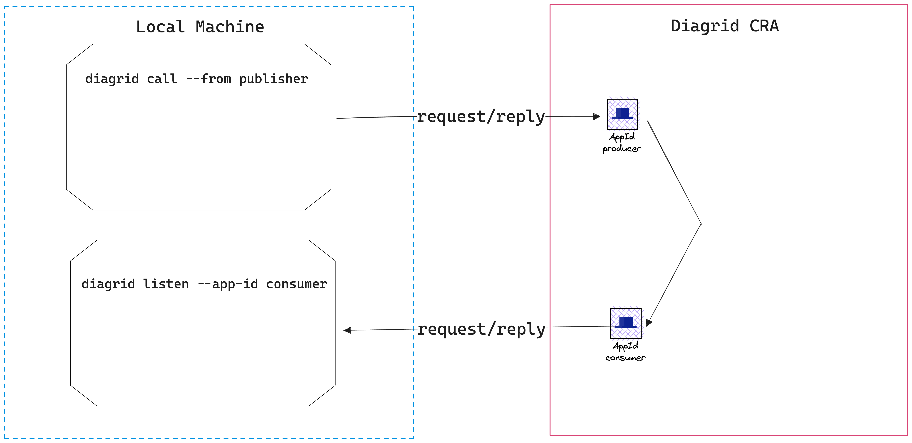
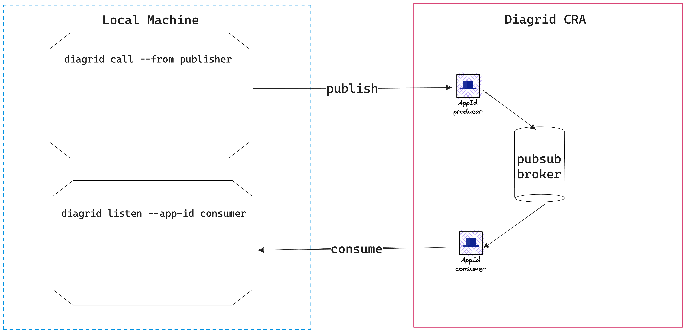

# Quickstart: Hello World

Welcome to the Diagrid CRA Hello World guide. This tutorial is designed to provide you with the quickest way to experience the capabilities of CRA APIs using the Diagrid CLI only. By the end of this guide, you'll have set up two appIds: one acting as a message producer and the other as a message consumer. This setup will allow you to explore both synchronous request/reply and asynchronous pub/sub interactions.

The Diagrid CLI will serve as our primary tool, enabling us to simulate application behaviors, make outbound API calls, publish messages, and handle inbound requests and message consumption.

## Prerequisites

Before we begin, ensure you're equipped with:

- A Diagrid CRA account.
- The Diagrid CLI installed on your machine.

## Installing the Diagrid CLI

To begin, install the Diagrid CLI:

```bash
curl -o- https://downloads.stg.diagrid.io/cli/install-cra.sh | bash
```

## Setting Up Your Project

First, check if you have an existing project in Diagrid CRA. If not, we'll create a new one named "quickstarts". If you do have an existing project, ensure it includes the default managed services: a pubsub broker and a kvstore.

Authenticate and set up your project with the following commands:

```bash
diagrid login --api https://api.diagrid.io
diagrid project create quickstarts --deploy-managed-pubsub --deploy-managed-kv
diagrid project use quickstarts
```

## Setting Up AppIds for Publisher and Consumer

In Diagrid CRA, every application requires a corresponding remote identity, known as an `appId`.

Set up two appIds for our publisher and consumer:

```bash
diagrid appid create publisher
diagrid appid create consumer
```

An appId acts as the digital twin for an application in CRA, serving as the primary point of contact.

## Demonstrating Synchronous Request/Reply

To illustrate synchronous communication between two applications, we'll use the Diagrid CLI. This tool can initiate calls to appIds and handle incoming calls.



Start by setting up the receiver (consumer):

```bash
diagrid listen --app-id consumer
```

This command establishes a network tunnel, channeling all calls to the `consumer` appId and displaying them in your terminal. The initial setup might take a moment, but subsequent interactions are swift.

With the consumer ready, initiate a call from the publisher in a new terminal:

```bash
diagrid call invoke post consumer.api/orders --from publisher --data '{"orderId":1}'  
```

Here's what happens:

1. The command impersonates a local publisher application using the publisher appId token.
2. It reaches out to Diagrid CRA's invoke API with the HTTP POST method, sending the payload `{"orderId":1}`.
3. The request targets the `/api/orders` endpoint of the `consumer` appId, which routes it to the local application.
4. The response is displayed, typically a 204 status with no response body.

Experiment with other HTTP methods like GET, DELETE, and PUT. After testing, halt the consumer app in the other terminal.

## Advantages of Using CRA's Invoke API

In our demonstration, the call journeyed from the publisher, through the CRA APIs, and back to the consumer. In real-world scenarios, these would be distinct applications on cloud infrastructure. Using CRA APIs for communication offers:

- **Service Discovery**: Locate and communicate with services without hardcoding addresses.
- **Reliability**: Built-in resiliency policies ensure robust communication.
- **Security**: Enforce authentication and authorization for secure interactions.
- **Observability**: Access metrics, logs, and a visual topology view.


## Demonstrating Asynchronous Communication with Pub/Sub

Let's explore asynchronous communication between the publisher and consumer using Diagrid's Pub/Sub mechanism.




### Setting Up the Pub/Sub Broker

Every Diagrid project comes with a default message broker named `pubsub`. If, for some reason, it's missing, you can easily set one up:

```bash
diagrid pubsub create pubsub
```

### Configuring the Consumer's Subscription to the `orders` Topic

With the broker in place, the next step is to subscribe the consumer appId to the `orders` topic:

```bash
diagrid subscription create orders-consumer --connection pubsub --topic orders --route /orders --scopes consumer
```

This command ensures that all messages directed to the `orders` topic are routed to the `/orders` endpoint of the consumer application.

To simulate the consumer's behavior, we'll use the Diagrid CLI:

```bash
diagrid listen --app-id consumer --subscription orders-consumer
```

This blocking command acts as a local consumer application, logging incoming messages from the specified subscription.

### Publishing Messages to the `orders` Topic

To dispatch a message to the `orders` topic, use:

```bash
diagrid call publish orders --connection pubsub --data '{"orderId":0}' --app-id publisher
```

This command, representing the publisher's action, sends a message to the `orders` topic. A successful dispatch will return a 204 response code.

For experimentation, you can modify the `orderId` value and dispatch multiple messages. The consumer, running in the other terminal, should promptly log these incoming messages.


## Next steps
This tutorial demonstrates the fastest way to interact with CRA APIs. As a next step, you can run real applicaiton with CRA APIs and discover the full power of Diagrid CLI in the next tutorial.

## Clean Up Cloud Resources
Clean up the cloud resources:

- Delete specific appIds:

```bash
diagrid appid delete publisher 
diagrid appid delete consumer
diagrid subscription delete pubsub-consumer
```

By executing these commands, the `publisher`, `consumer` appIds, and `orders-consumer` subscription will be removed from the Diagrid CRA platform. However, other resources associated with the project, like the managed pubsub broker or key/value store, will remain intact.

- **Delete the Entire Project**: If you wish to remove all resources associated with the `quickstarts` project, including appIds, managed services, and configurations, you can delete the entire project:

```bash
diagrid project delete quickstarts
```

Always double-check before executing deletion commands as they're irreversible.
 